## CC5205-3: Yet Another Spotify Song Recommender 🎵

Proyecto curso CC5205-3, FCFM, Universidad de Chile

<a href="https://colab.research.google.com/drive/1HAjICvI4BQDpqVcpMme1VEjEyHRt582t?usp=sharing" target="_blank">
  
</a>.

Índice con la documentación del proyecto [acá](https://github.com/alcazar90/CC5205-3-proyecto/tree/main/doc)📚.

**Tabla de contenidos**

- [Motivación](#motivación)
- [Dataset](#dataset)
- [Análisis Exploratorio](#análisis-exploratorio)
	- [Preguntas & Problemas](#preguntas-y-problemas)
- [Anexos](#anexos)
	- [Anexo 1: Diccionarios de Datos](#anexo-1-diccionarios-de-datos)

## Motivación

Hoy en día, el boom tecnológico ha hecho que el mercado global sea cada vez más competitivo al 
momento de captar clientes. Dentro de esta competitividad, han surgido nuevas estrategías y 
algoritmos para poder lograr que la experiencia del consumidor sea la más grata y sencilla. 
¿Cómo logra un nuevo servicio posicionarse en el mercado? ¿Cómo logra mantener a sus usuarios satisfechos?. Hoy existen varias metodologías para esto, particularmente hablaremos de los sistemas de recomendación.

Los sistemas de recomendación son una tecnología ampliamente usada en los servicios digitales, desde el _e-commerce_ hasta las plataformas de _streaming_. Qué mejor que, al comprar tus zapatillas favoritas, o al ver una buena pelicula, exista un algoritmo que te vaya recomendando productos o experiencias similares a las que acabas de comprar o ver. 

Como explicamos anteriormente, el entusiasmo e interés de empresas en perfeccionar esta tecnología se puede palpar en diversas competencias y servicios que utilizamos diariamente, como el de [Netflix](https://en.wikipedia.org/wiki/Netflix_Prize) y [Spotify](hhttps://www.aicrowd.com/challenges/spotify-million-playlist-dataset-challenge).

La idea principal es acercar la oferta lo máximo posible a los intereses de los usuarios y/o consumidores. Por un lado, los usuarios ahorran tiempo y frustración evitando el bombardeo de opciones irrelevantes, y en el mejor de los casos, pueden llegar a encontrar su próxima pareja, su nueva canción favorita, o la siguiente serie o película que comentaran en su próxima reunión de amigos.

Desde el lado comercial, el desafio es grande. Los consumidores se encuentran cada vez más expuestos 
a una cantidad abismante de información, el ruído en la atención de los consumidores es extremo, 
y su tiempo escazo. Las empresas que no logren orquestar sus catálogos de servicios o productos 
tendrán, en el mejor de los casos, un reclamo, y en el peor, la fuga de sus usuarios y clientes; Todo esto con impacto directo en 
la última línea del estado de resultados. Además, hay cada vez mayor competencia en servicios donde 
este tipo de tecnologias es particularmente relevante, y que antes algunas compañías gozaban de la ventaja de haber sido _first movers_. Esto es evidente en la industria  de _streaming_, como es el caso para las 
películas y series. Al principio, solo teníamos Netflix, en cambio ahora podemos ver más de una decena de
[servicios similares (i.e. Hbomax, Hulu, Paramount, Disney+)](https://www.wired.com/gallery/best-streaming-services/).
Recomendar a los usuarios contenido significativo para ellos ya no es un _nice to have_, sino un 
requisito para seguir siendo relevantes en la industria.

Dentro de este contexto, se encuentra la competencia [_"The Spotify Million Playlist Dataset 
Challenge"_](https://www.aicrowd.com/challenges/spotify-million-playlist-dataset-challenge), cuyo 
objetivo fue explorar (adivinen) 1 millón de _playlists_ con el próposito de investigar relaciones 
entre _playlists_ y canciones. De esta manera, descubrir nuevas formas de entender y enriquecer el 
servicio conocido como _automatic playlist continuation_, el cual como bien dice su nombre, permite 
continuar reproduciendo música una vez que la lista de canciones haya finalizado, recomendando canciones 
similares basadas en la lista, pero que estén fuera-de-ella.

Los datos que se pueden ver en la sección _Datasets_, presenten una oportunidad para "descubrir" nuevos
artistas, y más allá del sistema de recomendación en sí, explorar cómo categorizar _playlists_ usando 
otros atributos aparte del género musical. Finalmente, tendremos la oportunidad de construir un prototipo que pueda 
recomendar canciones dado un _playlist_, aprendiendo a menor escala, un caso de uso relevante en la industria.

El principal beneficio del servicio _automatic playlist continuation_ es el que busca toda empresa hoy en día,
mejorar la experiencia del consumidor a través de una experiencia más armonica y completa al escuchar música. 
Además, los usuarios podrán descubrir nuevas canciones, con el potencial de ir "reclutándolas" a sus listas, 
y agregando a su radar nuevos artistas que puedan ser de su interes.

## Dataset

El _dataset_ utilizado en este proyecto es de carácter público y proviene de dos fuentes:

1. El _dataset_ del millón de _playlists_ de Spotify cuya curatoría de datos
se encuentra disponible para descargar en las plataformas competitivas de [Aircrowd](https://www.aicrowd.com/challenges/spotify-million-playlist-dataset-challenge) y [Kaggle](https://www.kaggle.com/datasets/adityak80/spotify-millions-playlist). Esta información fue liberada por Spotify para fines del concurso y no es posible recopilarla directamente a través de su API.
1. Información sobre artistas y canciones que descargamos desde la [API de Spotify](https://developer.spotify.com) para desarrolladores con el propósito de complementar y enriquecer los datos del punto anterior.


Adicionalmente, en el directorio [`/data`](https://github.com/alcazar90/CC5205-3-proyecto/tree/main/data) de este repositorio se encuentran
versiones de las tablas de información para 20.000 _playlists_ (muestra aleatoria), con la información necesaria para complementar los artistas y canciones de estas. El objetivo de esta muestra es realizar pruebas y experimentaciones de manera rápida previo a escalar los análisis al _dataset_ de trabajo (consistente en una muestra aleatoria de 500.000 muestras).

* [Muestra al azar de 100.000 listas](https://drive.google.com/file/d/1pWUP8YJ4BryPhzprn24_VP-EZOv_4jLN/view?usp=sharing)
* [Tracks Feature](https://drive.google.com/file/d/1RDbXdqha6usjy_i2exrVFfQE1cXgGsSv/view?usp=sharing)

En el se [Anexo-1](#anexo-1-diccionarios-de-datos) encuentra el _codebook_ para las 3 tablas de información que conforman el dataset.


## Análisis Exploratorio

El análisis exploratorio de los datos lo realizamos por separado para las distintas tablas del dataset para poder entender mejor como están distribuidas las distintas variables, ya que cada tabla posee distintas estructuras.

### Tabla Playlists

El análisis se realizó sobre la muestra aleatoria de 500.000 playlists.

#### Exploración de nulos

<table style="border:none;">
  <tr>
    <td>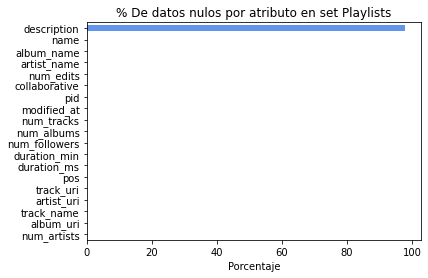</td>
    <td style="width: 50%">
      El único atributo con gran cantidad de nulos (cercano al 100% de los registros) es el atributo description. Omitiendo éste, existen 21 registros con datos nulos. Por tanto, se decide excluir este atributo del análisis, y luego omitir los registros restantes que presenten algún dato nulo. 
      De esta forma, se cuenta con <strong>6.626.859 filas</strong> y <strong>17 columnas</strong>, de las cuales se mostrará los resultados de las más relevantes.
    </td>
  </tr>
</table>

#### Análisis univariado

Al explorar las **variables categóricas más relevantes**, se obtienen las siguientes frecuencias relativas


<table style="border:none;">
  <tr>
    <td>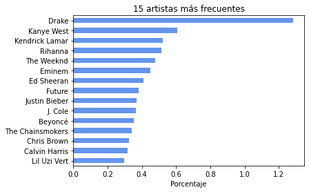</td>
    <td>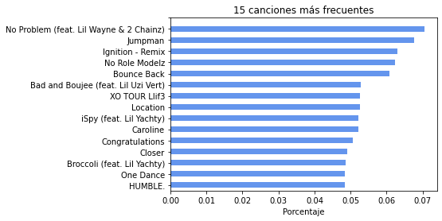</td>
    <td>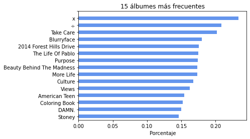</td>
  </tr>
</table>

En general, se destaca que todas las frecuencias son muy bajas, lo que indica que el set _cuenta con una gran variedad de artistas, canciones y álbumes_, siendo sus cantidades de valores únicos **108.155, 689.282 y 273.486 respectivamente**. De todos estos, el que presenta la frecuencia relativa más alta alcanza solo el 1.3%, correspondiente al artista _Drake_. En los álbumes destaca que los más frecuentes sean "x" y "%". Se tendrá esto en cuenta en caso de ser un atributo requerido en algún modelamiento, ya que estos podrían corresponder a valores nulos. Se exploró también la frecuencia del atributo `collaborative`, el cual es desbalanceado, siendo colaborativas solo el 5% de las listas.

<table style="border:none;">
  <tr>
    <td style="width: 50%">
      Se exploró también las **palabras más frecuentes** para los nombres de las listas y los nombres de las canciones.
      En el primer caso, se destaca que al parecer sí existe una cantidad importante de listas en cuyo título hacen alusión a un género o categoría musical (omitiendo la gran presencia de la palabra "music"). En cuanto a los nombres de canciones, destaca la presencia de la palabra "Love", la cual quizá podría no ser un buen discriminante por al parecer estar presente en diversidad de canciones. Destaca también la gran presencia de palabras como "remix", "feat", "version" y "remastered" aludiendo a que probablemente muchas de las canciones constituyen versiones alternativas y/o colaborativas con otros artistas.
    </td>
    <td>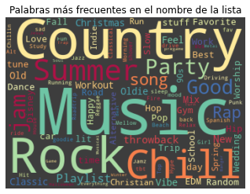</td>
    <td>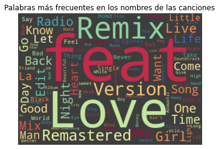</td>
  </tr>
</table>

Por último, se exploró la **distribución de los siguientes atributos numéricos**

<center>
  <table style="border:none;">
    <tr>
      <td>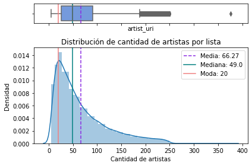</td>
      <td>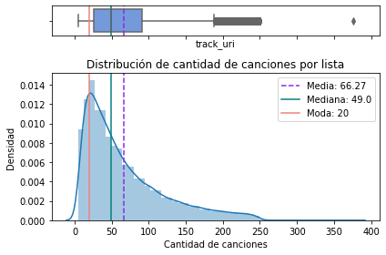</td>
      <td>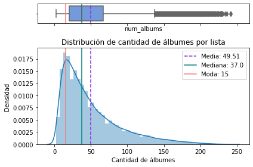</td>
    </tr>
  <tr>
      <td>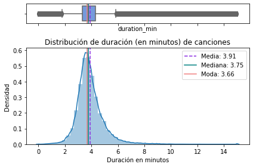</td>
      <td>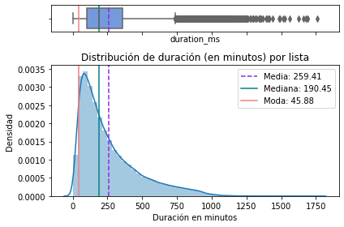</td>
      <td>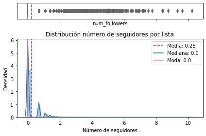</td>
    </tr>
  </table>
</center>

En general, se aprecia que las distribuciones se encuentran sesgadas a la derecha, o con sesgo positivo, indicando que existen valores extremos muy altos alejados de los valores más frecuentes para estos datos. 

El único atributo que presenta una distribución más cercana a la normal, es el de la duración de minutos por canción (se consideró todas las canciones sin eliminar duplicadas, para apreciar la distribución del tiempo). En el gráfico, se aplicó la función `clip` de pandas para que se considerara a todas las canciones con duración mayor a 15 minutos como que ésta fuera de 15 (esto corresponde a 3.302 canciones no únicas). Al explorar algunas de estas canciones, se puede ver que al parecer corresponden en su mayoría a remixes, álbumes completos, o postcasts. Este podría ser un criterio a considerar en caso de un futuro modelo, ya que podría querer recomendarse audios que efectivamente correspondan a canciones, tomando en cuenta su duración.

Por otro lado, en el caso del número de seguidores, se debió aplicar escalamiento logarítmico, ya que existen algunas listas con cantidades muy altas de seguidores respecto de la mayoría. Por ejemplo, la lista con más seguidores tiene 27.830 seguidores mientras que el promedio es de 2.6 seguidores. Esto podría indicar que quizás el algoritmo de recomendación tiende a favorecer más aquellas listas con muchos seguidores, haciendo de esta forma que su cantidad de seguidores siga creciendo cada vez más. Es algo que se podría tomar en cuenta al momento de recomendar una canción.

#### Análisis multivariado

<table style="border:none;">
  <tr>
    <td>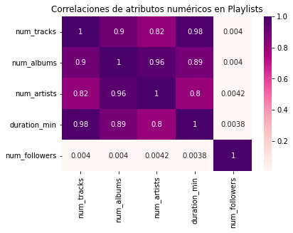</td>
    <td style="width: 50%">
      Se exploró las correlaciones de atributos numéricos de las listas, con el fin de observar si la cantidad de seguidores de una playlist (lo cual podría ser consecuencia de una recomendación automatizada) se correlaciona con su cantidad de artistas, canciones, álbumes, o duración. En este caso, se ve que prácticamente no existe correlación entre estos atributos y la cantidad de seguidores. Por tanto, la cantidad de seguidores debe relacionarse con otras características, posiblemente intrínsecas a las canciones y/o artistas, que no se observan en este set de datos. El resto de los atributos sí presenta correlación alta, como era de esperarse.
    </td>
  </tr>
</table>


<table style="border:none;">
  <tr>
    <td>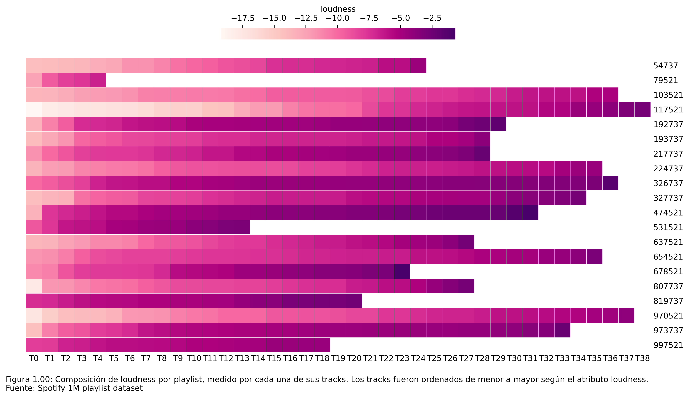</td>
    <td style="width: 50%">
      El objetivo de este análisis fue crear una visualización que nos permita inspeccionar un grupo de playlists con sus respectivos tracks y la dimensión de un atributo de estos (e.g. loudness).
El propósito de esta visualización es de validación, y su tarea es, una vez que tengamos la capacidad de recomendar nuevos tracks para cada lista, si este set de nuevos tracks propuestos tienen un comportamiento similar al set de cancions ya en el playlist según una dimensión descriptiva del track (e.g. danceability).
Otro aspecto interesante que nos permitiría ver esta visualización es sí hay algun patrón por atributo de tracks en como los usuarios van creando las playlists (i.e. slow to fast o quiet to loud).
    </td>
  </tr>
</table>


### Tabla Artistas

Esta tabla tiene dos columnas numéricas que representan: 1) la cantidad de seguidores que tiene el artista y, 2) la popularidad del artista. Las otras columnas son de tipo texto-objeto, de las cuales resaltamos: 1) los géneros musicales del artista y, 2) el nombre del artista, las demás columnas no agregan valor al análisis. Por lo tanto, nos quedaremos con las columnas numéricas y variables de texto que posiblemente nos serán útiles a la hora de clasificar o predecir preferencias, dejándonos un total de 110.135 filas y 7 columnas.

#### Análisis univariado

Al explorar las variables numéricas tenemos los siguientes resultados:

<table style="border:none;">
  <tr>
    <td style="width: 50%">
	    Dada a la gran diferencia de followers entre los artistas es que se debe aplicar escala logarítmica, debido a que el artista con mayor número de seguidores tiene 94.522.435 seguidores, mientras que los demás tienen, en promedio, 2.643 seguidores. Podemos notar que en esta escala la cantidad de followers distribuye sin grandes sesgos, casi normal se podria decir.
    </td>
    <td>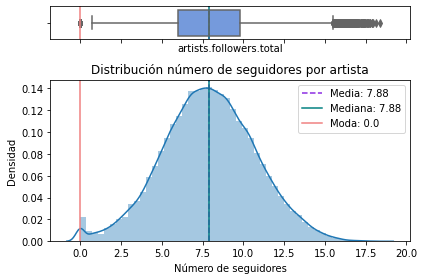</td>
  </tr>
  <tr>
    <td style="width: 50%">
	    Por otra parte, podemos ver que la popularidad de los artistas se distribuye con sesgo positivo. Además, el boxplot nos indica de la existencia de los outliers que, en este caso, serían los artistas cuya popularidad es cercana al 100.
    </td>
    <td>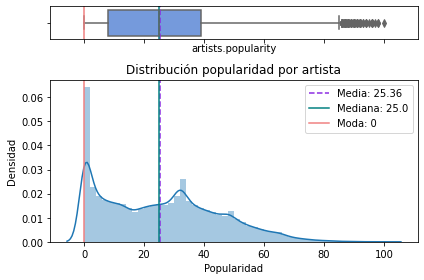</td>
  </tr>
</table>
 
 Para seguir el análisis se hizo un `merge` entre la tabla playlist (que contiene las canciones y el id_artista) y artist, y se contabilizó la cantidad de géneros repetidos.
 
 <table style="border:none;">
  <tr>
    <td style="width: 50%">
	    **¿Cuáles son los géneros que más se repiten en el dataset?** \
Como se ve en el gráfico, algunos de los géneros más repetidos en las playlist son: pop, dance pop, rap, pop rap, hip hop, etc. Cabe destacar que las canciones no tienen un género musical establecido, el género lo tienen los artistas.
    </td>
    <td>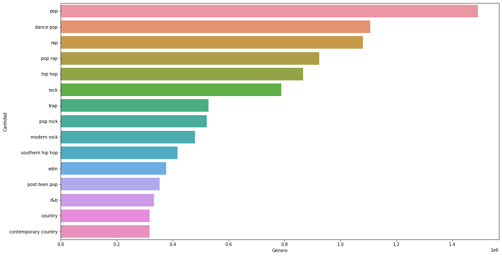</td>
  </tr>
</table>

Como Spotify es el encargado de establecer los géneros de los artistas, muchos de ellos (exactamente 242581 artistas) simplemente no tienen un género musical.

#### Análisis multivariado
 <table style="border:none;">
  <tr>
    <td style="width: 50%">
	    Se utilizó la matriz de correlación con los atributos numéricos (popularidad, seguidores y frecuencia de aparición) para saber si el atributo “frecuencia de aparición” de un artista se correlaciona con su número de followers y/o popularidad. 
Como se ve en la matriz, existe correlación positiva (0.67) entre el número de veces que aparece un artista con su número de seguidores, lo cual tiene sentido, ya que al tener un gran número de seguidores mayor será la exposición del artista. De igual manera el atributo popularidad presenta una correlación positiva (0.31) que se relaciona con la explicación anterior. Otra correlación interesante se presenta entre la cantidad de followers de un artista y su popularidad, la cual es positiva (0.31). Normalmente se esperaría que la correlación fuera más alta, pero claro, debemos tener en consideración que estas variables cambian con el tiempo, dándonos una justificación de que no necesariamente los artistas con mayor cantidad de seguidores tienen mayor popularidad.
    </td>
    <td>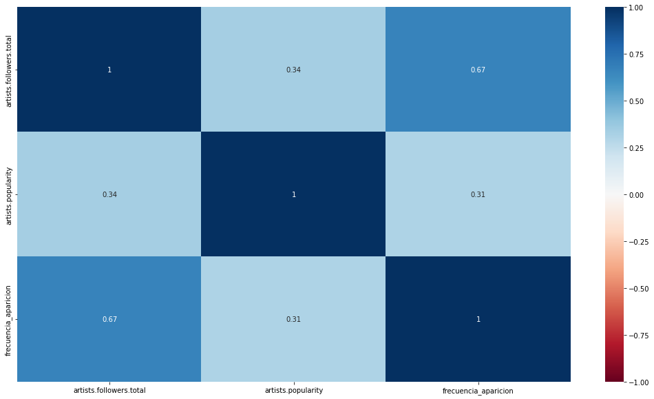</td>
  </tr>
</table>


### Tabla Features

#### Análisis univariado

Esta última tabla contiene valores numéricos que describen características de las canciones que posiblemente nos serán útiles para clasificar o predecir preferencias. Podemos notar que cuatro de las variables (energy, tempo, danceability y valence, panel A) tienen una distribución simétrica y equitativamente repartida en el rango (similar a una distribución normal). Dos de las variables (duration y loudness, panel B) presentan outliers que ensucian los datos, por lo que sería necesario eliminarlos antes del análisis. Otras variables (acousticness, speechness, liveness e instrumentalness, panel B) tienen distribuciones muy cargadas hacia ciertos valores, particularmente valores bajos. Pareciesen comportarse como características pseudo binarias, donde si posee la característica tendrá valores entre ~0.2 y 1 con probabilidades similares, siendo el caso extremo instrumentalness. Podría ser necesario realizarles alguna transformación matemática o  convertirlos a variables categóricas. Finalmente, las variables mode, time_signature y key toman una cantidad limitada de valores. Mode al tomar sólo 2 valores debería ser considerado como variable categórica donde la mayoría de las canciones está en tonalidad mayor. Key está uniformemente repartida por lo que podría ser útil en la clasificación, y no sería necesario considerarla categórica. Time signature es un caso especial. Notamos que hay outliers correspondientes posiblemente a datos erroneos (No existen compás 0/4). También sería necesario transformarla, ya que no hace sentido considerarla una cantidad.

> #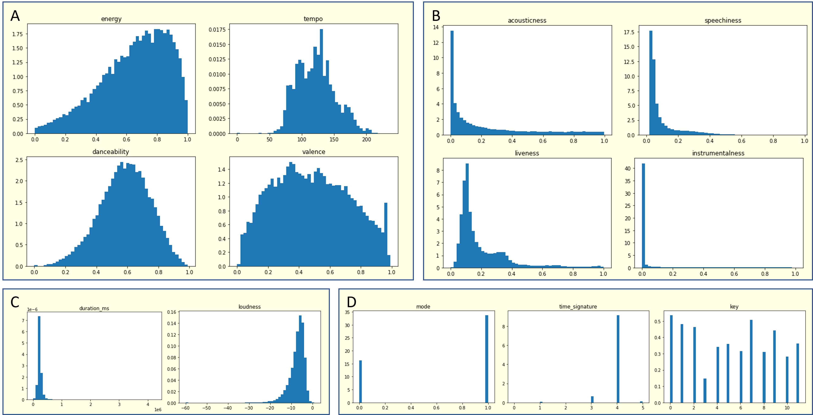

#### Análisis multivariado

Para entender como estas variables se relacionan entre sí, realizamos análisis de correlación múltiple entre todas estas variables (A). Las correlaciones pueden ser mostradas de forma más claras mediante vectores provenientes de PCA (B). Si bien esta técnica tiene otras aplicaciones, es útil para ilustrar cómo  las variables se relacionan entre ellas. Vectores que apuntan en la misma dirección indica correlación positiva, direcciones opuestas indica correlación negativa y perpendicularidad indica no correlación, que es proporcional al largo del vector. Así, los vectores pequeños indican datos ruidosos mientras vectores grandes indican datos que aportan información útil. Observamos que energy y loudness están altamente correlacionados entre sí, por lo que una canción es energética probablemente cuando su volúmen es alto. Al entregar información similar, podrían fusionarse en una sola variable. Acousticness por el contrario estaría fuertemente vinculada a canciones con volumenes bajos. Sorprendentemente, tempo y liveness también se comportan de forma similar. Valence y danceability y en menor medida speechness tambien correlacionan positivamente, indicando que las canciones bailables tienden a ser más alegres y vocales. Sin embargo, valores como key son mayoritariamente ruidosos. Esto hace sentido ya que teóricamente la nota en la que la escala está basada no hace ninguna diferencia en la percepción musical. 


> #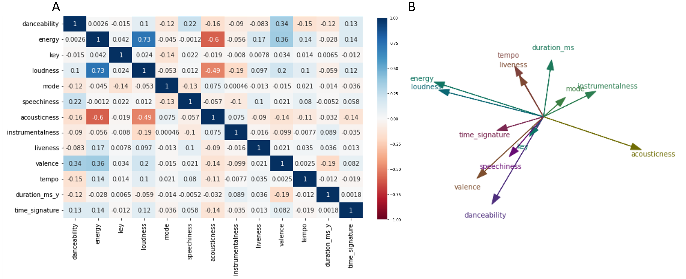

Estas tendencias también pueden visualizarse con el gráfico de PCA coloreado con cada característica. Observamos que la gran mayoría de las canciones se ubica en dirección a "Energy", por lo que este tipo de canciones correspondería a la moda. En cambio, en la dirección opuesta existe una "nube" de canciones con características más diversas y menor densidad, posiblemente más relacionado a música alternativa. En time_signature prima 4/4 hacia energy/danceability mientras que en la dirección opuesta abundan los tiempos más irregulares basados en 3/4 o 5/4. Como 3<4<5 los análisis de correlación no detectan ninguna tendencia, por lo que sería conveniente transformar esta variable en "regularidad". En conjunto, se observa que la "nube" de canciones con características diversas presenta mayor abundancia de canciones instrumentales, acústicas, valencia negativa, son poco bailables y energéticas, y tienen duración más larga y tiempos irregulares.

> #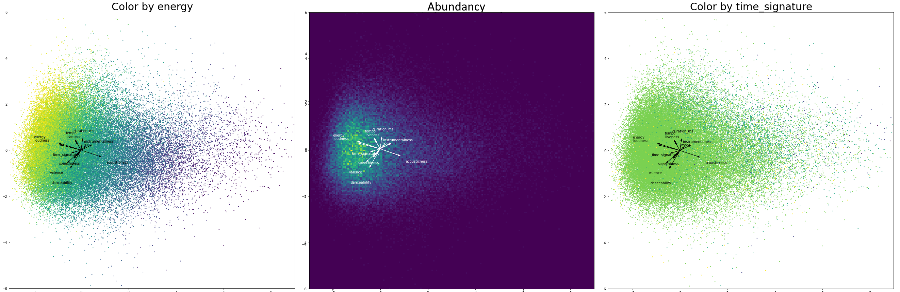

### Preguntas y Problemas

Con el dataset descrito, procederemos a responder las siguientes preguntas:

-¿Es posible categorizar las playlists o los géneros en base a las características de sus canciones y artistas, con el fin de luego recomendar canciones similares?

-¿Existe alguna correlación entre las características de las canciones y la probabilidad de que estas se encuentren en la misma playlist o tengan el mismo género?

-¿Se debe recomendar una canción en base a su popularidad (ej, gran presencia en muchas listas), o en base a las características de la mismas que sean similares a las del gusto del usuario?

-¿Qué factores influencian en que una canción, artista o género sea más popular que los otros?

-¿Es posible realizar una recomendación en base a las características de las canciones que esta escuchando en el momento y no en base a su histórico? (ej, siempre escucha canciones "felices" y en ese momento esta escuchando musica "triste", ¿qué se prioriza?)


Dadas las preguntas por responder, podríamos encontrarnos con los siguientes problemas: 

-Falta de datos: Spotify utiliza más de 4 millones de listas para su algoritmo de recomendación. Debemos determinar con las metodologías pertinentes si la cantidad de datos que tenemos será suficiente para poder obtener un sistema de recomendación con buen rendimiento.

-Cambio de preferencias: dado que las tendencias músicales cambian constantemente debido a nuevos hits de diferentes generos o incluso por cambios en los gustos musicales de cada individuo, es problable que un sistema de recomendación de canciones o listas tenga problemas de generalización.

-Casos bordes: Existen casos de usuarios con preferencias diversas e impredensibles. En este caso, existen problemas para poder entregar buenas recomendaciones a usuarios con una gran variedad de géneros dentro de su listas o usuarios que escuchen música poco común como Crunkcore, Murga, entre otros.

## Anexo 1: Diccionarios de datos

### Tabla playlists

Obtener una playlist del usuario: [Get Playlist](https://developer.spotify.com/documentation/web-api/reference/#/operations/get-playlist). Esta tabla continee en forma desagregada detalle de las canciones y las playlists a las que pertenecen. 

| Feature  | Tipo de variable | Descripción  |
|----------|------------------|---------------|
| name | object | Nombre de la playlist |
| colabborative | boolean | Si es una lista colaborativa o no |
| pid | int | Identificador de la lista |
| modified_at | datetime | Fecha de modificación de la lista |
| num_tracks | int | Cantidad de canciones en la lista |
| num_albums | int | Cantidad de álbumes en la lista |
| num_followers | int | Cantidad de álbumes en la lista |
| num_edits | int | Cantidad de ediciones a la lista |
| duration_ms | int | Duración de cada canción en milisegundos |
| num_artists | int | Cantidad de artistas en la lista |
| description | string | Descripción de la lista |
| pos | int | Posición de la canción en la lista |
| artist_name | string | Nombre del artista de la canción |
| track_uri | string | URL para obtener información de la canción |
| artist_uri | string | URL para obtener información del artista la canción |
| track_name | string | Nombre del track |
| album_uri | string | URL para obtener información del álbum de la canción |
| album_uri | string | Nombre del álbum de la canción |

### Tabla artistas
| Feature  | Tipo de variable | Descripción  |
|----------|------------------|---------------|
| external_urls | object | URL externas conocidas para este artista. |
| external_ursl.spotify | string | Variable que contiene la URL que redirecciona al perfil del artista. |
| followers | object | Contiene información acerca del artista. |
| followers.href | string | Esto siempre se establecerá en nulo, ya que la API web no lo admite en este momento. |
| followers.total | int | Número total de seguidores. |
| genres | list of strings | Lista de los géneros a los que está asociado el artista. Si aún no se ha clasificado, la lista estará vacía. |
| href | string | Link que proporciona los detalles del artista (que son estos mismos datos).
| id | string | El Spotify ID del artista. |
| images | list of objects | El objeto contiene imágenes del artista en varios tamaños. |
| images.url | string | La URL de la imagen. |
| images.height | int | La altura de la imagen en píxeles. |
| images.width | int | El ancho de la imagen en píxeles. |
| name | string | El nombre del artista. |
| popularity | int | Es la popularidad del artista representada como número. El valor estará entre 0 y 100, siendo 100 el más popular. La popularidad del artista se calcula a partir de la popularidad de todas las pistas del artista. |
| type | string | El tipo de objeto (por defecto será 'artist'). |
| uri | string | El [URI](https://developer.spotify.com/documentation/web-api/#spotify-uris-and-ids) de Spotify. |

### Tabla canciones

Es posible extraer para cada canción los _audio features_ que se encuentran
documentados [acá](https://developer.spotify.com/documentation/web-api/reference/#/operations/get-several-audio-features).

| Feature  | Tipo de variable | Descripcción  |
|----------|------------------|---------------|
| acousticness   | float  | Medida de confianza de 0.0 a 1.0 si la canción es acustica. El valor 1.0 representa una alta confianza de que la canción sea acustica. |
| danceability  | float   | Medida que describe que tan bailable es una canción en base a una combinación de elementos musicales como el tempo, estabilidad de ritmo, entre otros. Un valor de 0.0 significa poco bailable y 1.0 muy bailable.  |
| duration_ms  | integer  | Duración de la canción registrada en milisegundos.  |
| energy  | float  | La energía es una medida de 0.0 a 1.0 y representa una medida de percepcción de intensidad y actividad. Generalmente, las canciones energeticas se siente rápidas, fuertes y ruidosas. Ejemplo, el _death metal_ tiene alta energía, mientras que un preludio de Bach tiene un medición baja en la escala.   |
| instrumentalness  | float  | Predice si una canción no contiene vocales. "Ooh" and "Aah" son tratados como instrumentales en este contexto. El Rap o canciones con palabras habladas son claramente "vocales". Mientras más cercano es el valor de `instrumentalness` a 1.0, mayor es la probabilidad de que la canción no contenga vocales.|
| liveness| float  | Detecta la presencia de audiencia/público en la grabación. Valores altos de `liveness` representan una mayor probabilidad de que la canción haya sido tocada en vivo. |
| loudness  | float  | El volumen total de la canción registrado en decibeles (dB). El volumen es promediado a lo largo de toda la canción y es útil para comparar el volumen relativo entre canciones. Los valores en general se encuentran entre -60 y 0 db.|
| mode  | integer  | Indica la modalidad (mayor o menor) de una canción. Mayor es representado por 1 y menor por 0.  |
| speechiness  | float  | Detecta la presencia de vocales en una canción. Si la grabación tiene gran contenido de vocales (e.g. audiolibro, poesía, conversación), más cercano el atributo a 1.0. Valores sobre 0.66 describen canciones que probablemente esten hechas completas de palabras habladas. Valores entre 0.33 y 0.66 describen canciones que contienen música y letra, separadas o juntas, incluye casos como la música rap. Valores bajo 0.33 mayormente música y canciones sin vocales. |
| tempo  | float   | `tempo` estimado total de una canción en _beats_ por mínutos (BPM). En términos musicales, el `tempo` es la velocidad, o fase de una pieza, y se deriva directamente del _beat_ promedio de duración. |
| time_signature  | float  | Un estimado del compás. Es una convención que especifica cuantos _beats_ hay en cada línea (o medida). El compás tiene un rango desde el 3 al 7, indicando el compás de "3/4" al "7/4".|
| valence | float  | Una medida que va del 0.0 al 1.0 y describe la "positiividad" musical de una canción. Canciones con alto `valence` suenan más positivas (e.g. feliz, alegre, euforico), mientras que canciones con poco `valence` suenan más negativas (e.g. triste, depresivo, furioso).  |
| key  | integer  | Indica la nota fundamental de la escala musical en la que está la canción. A cada semitono se le asigna un valor distinto. Explícitamente, para canciones en Do (C), key=0, Do sostenido (C#), key=1, Re (D), key=2, y así sucesivamente. Por esto tiene 12 valores posibles  |

## Integrantes

```
@misc{CC5205-3-proyecto,
  authors = {Alcázar, Cristóbal}, {Callpa, Felipe}, {Cortez, Diego}, {Salomó, Gianina}, {Stears, Christopher}
  title = {Yet Another Spotify Song Recommender 🎵},
  year = {2022},
  publisher = {GitHub},
  journal = {GitHub repository},
  howpublished = {\url{https://github.com/alcazar90/CC5205-3-proyecto}},
}
```
